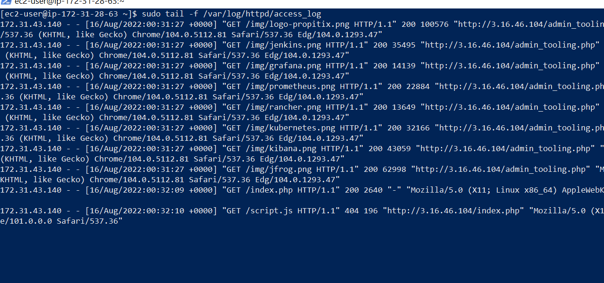
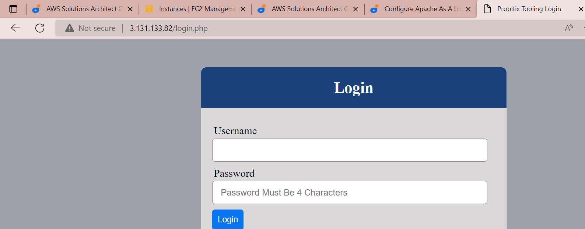
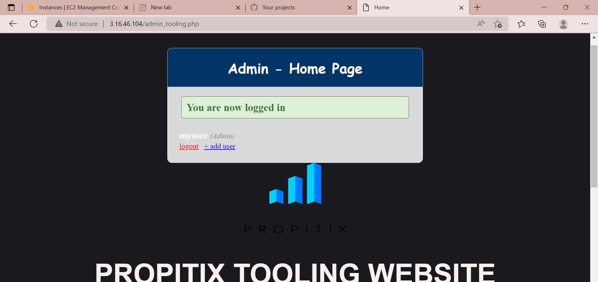

# project-8 : LOAD BALANCER SOLUTION WITH APACHE

## CONFIGURE APACHE AS A LOAD BALANCER

After Creating Ubuntu Server 20.04 TLS using Aws,

### Install apache2
* sudo apt update
* sudo apt install apache2 -y
* sudo apt-get install libxml2-dev

### Enable following modules:
* sudo a2enmod rewrite
* sudo a2enmod proxy
* sudo a2enmod proxy_balancer
* sudo a2enmod proxy_http
* sudo a2enmod headers
* sudo a2enmod lbmethod_bytraffic

### Restart apache2 service
* sudo systemctl restart apache2
* * sudo systemctl status apache2 - check the apache2 status
# Both Server recievs http request

#Each request have the same value
